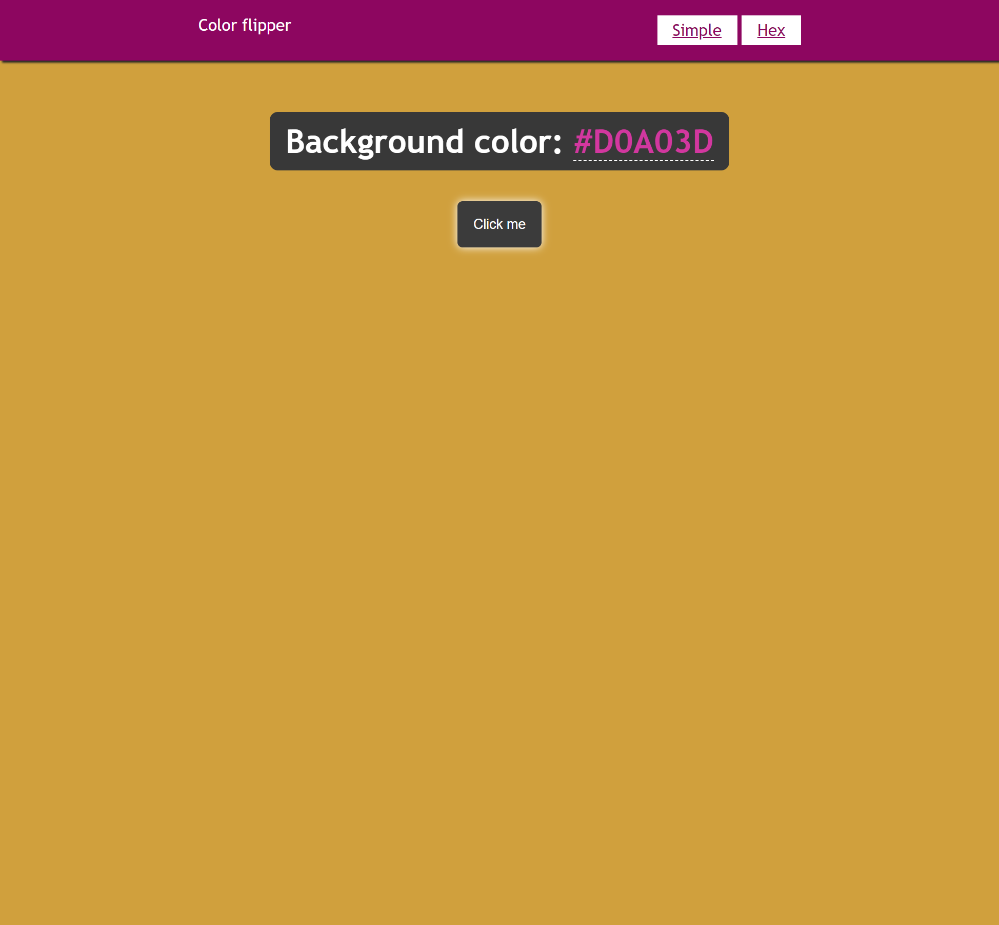

# Color Flipper
 A simple page with a button that when clicked on changes the body's background color.

[Ver este site no navegador](https://educoimbra.github.io/color-flipper/hex.html)

## Tecnologias
- HTML;
- CSS;
- Javascript;
- Git e Github.
